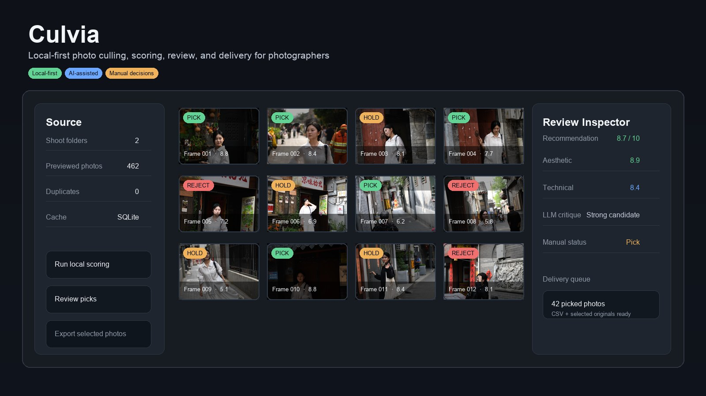
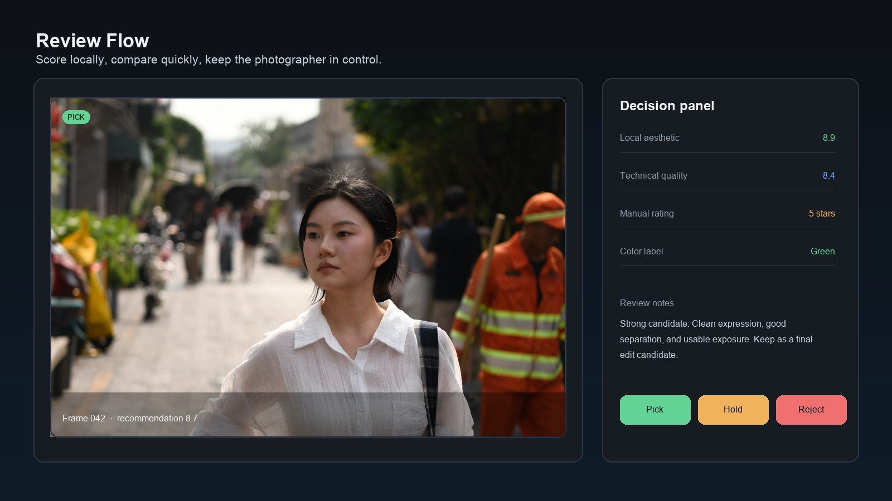

# Culvia

英文版：[README.md](README.md)

[](#项目状态)
[](pyproject.toml)
[](LICENSE)

Culvia 是一个本地优先的摄影选片、评分、复核和交付工作台。它帮助摄影师从一整组拍摄照片中筛出更有价值的画面，并把本地评分、可选的大模型图片评价、人工入选/待定/淘汰判断和导出工具放在同一个流程里。



## 设计目标

- **本地优先存储：**照片、缩略图、SQLite 数据、模型缓存、人工标记、上传缓存和导出结果默认都留在本机，只有显式启用外部图片评审时才会发送图片。
- **人工判断优先：**模型分数和大模型评价只是第二意见，人工判断始终是最终选片层。
- **单一复核流程：**扫描目录、浏览缩略图、评分、筛选、查看大图、标记入选、导出选中照片或 CSV，都在一个工作台里完成。

## 适用场景

Culvia 面向摄影师和本地照片量较大的工作流：人像、活动、婚礼、街拍练习、编辑精选、个人影像归档等。它适合处理一组照片里有大量相似帧，但最终选择仍需要人工审美判断的场景。

它不是 Lightroom Classic、Capture One、darktable 这类完整 RAW 编辑器的替代品。Culvia 更适合作为前置或并行的本地复核和选片层。

## 项目状态

> Culvia 目前仍是早期开源项目。工作流、桌面打包和模型接入会持续快速变化。

当前最直接的试用方式是 Python 包和本地 Web 应用。桌面打包能力已经存在，但早期公开桌面二进制可能未签名，应当按 alpha 发布资产看待。

## 快速开始

```bash
pip install culvia
```

然后启动本地 Web 应用：

```bash
culvia-supervisor
```

打开终端里显示的本地地址。也可以直接启动 server：

```bash
culvia-web --host 127.0.0.1 --port 8501
```

## 界面预览

下面的预览图使用练习照片素材展示流程，不包含原始文件或本地文件路径。



## 你可以用它做什么

- 导入本地照片目录，或临时上传图片。
- 自动扫描子目录，并去重重复路径。
- 为照片墙按需生成缩略图，避免缩略图场景加载高清原图。
- 运行本地审美和技术评分模型。
- 按需启用 OpenAI-compatible 大模型图片评审，获得图片评价、审美/技术细分分数、修图建议和拍摄建议。
- 在大图选片台或照片墙里复核照片。
- 添加人工判断：入选、待定、淘汰、星级和色标。
- 在模型或大模型建议有价值时，一键采纳为人工判断。
- 按推荐指数、技术质量、大模型评审、人工状态、色标等维度筛选和排序。
- 导出入选照片，或导出 CSV 结果用于后续整理和交付。

人工判断是最终选片层。模型分数用于排序、比较和解释，但不应该替代你的审美判断。

## 基本流程

1. 启动 Culvia，打开 Web 界面。
2. 选择一个或多个照片目录。
3. 等待 Culvia 扫描照片来源并生成照片墙。
4. 选择要运行的评分维度。
5. 开始评分，并在命令区查看进度。
6. 在选片台或照片墙里复核照片。
7. 将照片标记为入选、待定或淘汰。
8. 用筛选器收敛最终集合。
9. 导出入选照片或 CSV 结果。

## 隐私模型

Culvia 是本地优先的：

- 本地模型、缩略图、预览图、SQLite 数据、上传缓存和导出结果默认都保留在本机。
- 只有在你显式启用 OpenAI-compatible 大模型图片评审时，照片才会发送给外部服务。
- API key 应通过应用配置流程或环境变量提供，不应写入文档、测试、日志、SQLite 明文字段或 Git。

大模型配置可以来自当前会话、持久化的非密钥设置或环境变量。应用不应该要求你把凭据提交到仓库。

## 下载和发布说明

- Python 包：`pip install culvia`
- 源码启动：clone 本仓库后运行 `make init`
- 桌面包：发布资产可用后，从项目 GitHub Releases 页面下载
- 发布历史：见 [CHANGELOG.md](CHANGELOG.md)
- 项目摘要：见 [docs/zh-CN/project/project-summary.md](docs/zh-CN/project/project-summary.md)

## 安装与启动

### 从源码仓库启动

```bash
make init
make server
```

然后打开终端里显示的本地地址。默认通常是：

```text
http://127.0.0.1:8501/
```

只启动 Web server：

```bash
make web PORT=8501
bin/culvia-web --host 127.0.0.1 --port 8501
```

### 通过 pip 安装后

作为 Python 包安装后，Culvia 会提供命令行入口：

```bash
culvia-supervisor
culvia-web --host 127.0.0.1 --port 8501
culvia --help
```

- `culvia-supervisor`：推荐的本地 Web 启动方式，包含健康检查和自动打开浏览器。
- `culvia-web`：直接启动 Web 服务。
- `culvia`：命令行批量评分入口。

### Windows

从源码仓库启动时，可以使用 PowerShell 包装脚本：

```powershell
scripts/culvia-dev.ps1 init
scripts/culvia-dev.ps1 web --host 127.0.0.1 --port 8501
bin/culvia-web.ps1 --host 127.0.0.1 --port 8501
```

如果使用 Command Prompt：

```cmd
bin\culvia-web.cmd --host 127.0.0.1 --port 8501
```

## 桌面应用

Culvia 的设计目标是让同一套后端和界面既能在浏览器里运行，也能放进桌面应用壳里运行。桌面应用会提供原生窗口、本地文件能力、安全凭据存储和打包运行时。

### 早期桌面包未签名

这段说明适用于从 GitHub Releases 下载桌面二进制的用户：macOS Apple Silicon 或 Intel Mac 的 `.dmg` 包、Windows 便携 `.zip` 包，以及 Linux `.tar.gz` 包。通过 `pip install culvia` 安装，或从源码启动本地 Web 应用的用户，不需要处理桌面 app 签名问题。

当前桌面二进制还没有 Developer ID 签名、公证，也没有 Windows 代码签名。macOS Gatekeeper 和 Windows SmartScreen 可能提示“无法验证开发者”“来自未知发布者”，或者阻止首次启动。

只从项目 GitHub Releases 页面下载桌面包，并在运行前核对同页发布的 `.sha256` 文件。如果校验和不一致，不要运行该包。Release 资产也会生成 GitHub Artifact Attestations；下载某个资产后，可以用下面命令验证它来自本仓库的 GitHub Actions 发布流程：

```bash
gh attestation verify <downloaded-asset> --repo yangzhg/culvia
```

如果你信任该构建，但遇到系统拦截：

- macOS 提示应用来自无法验证的开发者：按住 Control 点击或右键点击应用，选择“打开”，然后再次确认“打开”。
- macOS 解压后仍然阻止打开：进入“系统设置 > 隐私与安全性”，找到 Culvia 的拦截提示，选择“仍要打开”。
- macOS 提示应用已损坏或被隔离：执行 `xattr -dr com.apple.quarantine /path/to/Culvia.app`，然后重新打开应用。
- Windows SmartScreen 阻止首次启动：解压便携 zip，运行 `culvia-desktop.exe`，选择“更多信息”，再选择“仍要运行”。
- Windows 标记下载的 zip 为已阻止：右键 zip 或解压后的 `culvia-desktop.exe`，打开“属性”，如果看到“解除锁定”，勾选后应用更改。
- Linux 提示 permission denied：在解压后的包目录中执行 `chmod +x bin/culvia bin/culvia-desktop`，然后运行 `bin/culvia`。

这些处理方式只针对早期公开构建。后续发布线可以在配置项目证书后加入 Developer ID 签名、公证和 Windows Authenticode 签名。

桌面打包仍在迭代中。构建说明见 [docs/zh-CN/developer/desktop-build.md](docs/zh-CN/developer/desktop-build.md)。

## 用户文档

- [快速开始](docs/zh-CN/user/getting-started.md)
- [导出工作流](docs/zh-CN/user/export-workflows.md)
- [英文用户文档](docs/en/user/getting-started.md)

## 开发者入口

开发文档从这里开始：

- [开发快速开始](docs/zh-CN/developer/getting-started.md)
- [系统架构](docs/zh-CN/developer/architecture.md)
- [数据库结构](docs/zh-CN/developer/database-schema.md)
- [桌面构建](docs/zh-CN/developer/desktop-build.md)
- [发布检查清单](docs/zh-CN/developer/release-checklist.md)

常用检查：

```bash
make pre-commit
make test
make js-check
make lint
```

## 社区与反馈

- 可复现 bug 或工作流问题：使用 GitHub issue 模板。
- 功能建议：先说明摄影工作流里的真实问题，再说明希望的产品行为。
- 参与贡献：见 [CONTRIBUTING.md](CONTRIBUTING.md)。
- 安全或隐私敏感报告：见 [SECURITY.md](SECURITY.md)。

AI 辅助开发和项目交接规则见 [AGENTS.md](AGENTS.md)。

## 仓库卫生

不要提交模型缓存、缩略图缓存、上传缓存、SQLite 运行库、导出结果、桌面构建产物、生成的安装包、API key 或本地日志。

常用清理工具：

```bash
python tools/clean_runtime_artifacts.py
```
