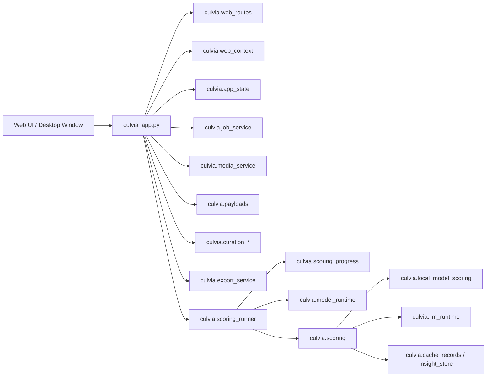

# Architecture

Simplified Chinese: [../../zh-CN/developer/architecture.md](../../zh-CN/developer/architecture.md)

Culvia is designed around one Python core, one Web frontend, and a thin desktop shell. The same codebase supports pip installation, local Web usage, and desktop packaging.

## Principles

- Local first: photos, thumbnails, SQLite, model caches, manual labels, and exports stay on the user's machine by default.
- Shared Web/App core: the desktop shell reuses the Starlette API, static frontend, scoring orchestration, and data layer.
- Desktop shell boundary: the current desktop shell implementation uses Tauri for the window, backend lifecycle, and native capabilities. Pywebview is only a lightweight fallback candidate, and Electron is not the default desktop route.
- Business logic belongs in Python modules: keep `culvia_app.py` as the app factory and route handler layer; new business behavior should live in `culvia/`.
- Testable boundaries: core services should use pure functions or injectable dependencies. Tests should cover behavior, data contracts, and packaging boundaries instead of fragile static page strings.

## Entrypoints

```text
culvia-supervisor    -> culvia.supervisor:main
culvia-web       -> culvia.server:main
culvia           -> culvia.cli:main
python -m uvicorn   -> culvia_app:app
```

- `culvia-supervisor` is the main local Web and desktop backend entrypoint. It provides port selection, `/health`, ready events, and browser opening.
- `culvia-web` is the development/deployment server entrypoint.
- `culvia` is the batch scoring CLI.

## Layers



## Core Module Boundaries

- `culvia_app.py`: creates the Starlette app, mounts static assets, and handles HTTP requests. Do not add new scoring algorithms, model downloads, export details, or recommendation formulas here.
- `culvia.web_routes`: declares API routes and static mounts; it should not read business state directly.
- `culvia.web_context`: adapts a Starlette request into runtime config, state store, job service, and authorized media paths.
- `culvia.app_state`: stores current results, source, filters, network/model/task state, and UI-facing state.
- `culvia.job_service`: manages scoring tasks, pause/resume state, and concurrency guards.
- `culvia.scoring_runner`: orchestrates source resolution, model preparation, progress reporting, scoring, and result refresh.
- `culvia.scoring`: owns local model scoring, LLM scoring, SQLite read/write, and batch scoring facade behavior.
- `culvia.recommendation`: owns recommendation scores, filter decisions, and weighting presets.
- `culvia.gallery_display` / `culvia.payloads`: convert DataFrames, manual labels, LLM insights, and file metadata into UI payloads.
- `culvia.curation_*`: owns manual pick/review/reject decisions, star ratings, color labels, history, and undo.
- `culvia.export_service`: exports CSV files, copies selected photos, and runs export preflight checks.
- `culvia.media_service` / `culvia.media_responses`: authorize media paths and serve thumbnails, previews, and upload cache files.
- `culvia.llm_config*` / `culvia.secret_store`: own OpenAI-compatible configuration, prompt presets, SQLite non-secret settings, and system keychain integration.
- `culvia.desktop_files` / `culvia.capabilities`: own native file capabilities and graceful capability fallback.

## Frontend

`web/index.html` owns page structure and static asset order. `web/*.js` modules are split by feature, `web/styles/` owns CSS slices, and `web/locales/` owns translated strings. `web/app_config.js` owns shared frontend field lists and static label maps; `web/distribution_model.js` owns distribution data transforms; `web/distribution_view.js` owns distribution markup; `web/viewer_inspector.js` owns viewer score, signal, and insight markup; `web/gallery_view.js` owns gallery card and tooltip markup; `web/icons.js` owns SVG path data; `web/ui_helpers.js` owns small stateless rendering helpers. New user-facing UI text must go into the locale files; `web/i18n_messages.js` is only the aggregation entrypoint. Modules should not embed bilingual fallback copy. Icon-only controls need `data-ui-tooltip` or an equivalent accessible label. Truncated text must expose the full value through copy behavior, `title`, or a tooltip.

Frontend tests should prioritize:

- i18n keys and HTML support attributes.
- Pure JavaScript behavior for filters, exports, shortcuts, manual decisions, and LLM configuration.
- Consistency between `pyproject.toml` package data and static references in `web/index.html`.

Do not add tests that only lock static version strings, CSS selector existence, or screenshot wrapper wiring.

## Desktop and Release Boundary

The desktop shell contract is `desktop/tauri/desktop-shell.contract.json`. The desktop shell must keep the local-http mode, same-origin `/api` and `/static`, and the production backend contract. The production backend exposes a ready event through:

```bash
culvia-supervisor --port auto --no-open --print-json
```

Desktop runtime profiles:

- `full`: release default. The desktop shell starts the bundled backend runtime and does not require user Python.
- `lite`: the desktop shell finds Python 3.11+, creates an app-managed virtualenv, installs `culvia[desktop-runtime]` when dependencies are missing, then starts `python -m culvia.server`.
- `auto`: prefer the bundled backend and fall back to `lite` when no bundled backend exists.
- `dev`: use the development server at `http://127.0.0.1:8501`.

`culvia.runtime_manager` owns the reusable Python-side runtime commands: `culvia runtime config`, `configure`, `reset-config`, `doctor`, `create`, `install`, and `ensure`. Desktop Lite mode reads `runtime.json` from the runtime directory, then applies environment variables as developer overrides. It must use a virtualenv under the user data directory or an explicit configured venv; it must not install packages into global Python.

Key tools:

- `tools/check_desktop_readiness.py`
- `tools/check_desktop_release_preflight.py`
- `tools/check_backend_smoke.py`
- `tools/check_backend_workflow_smoke.py`
- `tools/check_secret_store_keychain_smoke.py`
- `tools/check_macos_app_preflight.py`
- `tools/clean_macos_app_artifacts.py`
- `tools/build_macos_app.py`
- `tools/check_macos_artifact_preflight.py`
- `tools/check_macos_app_launch_smoke.py`
- `tools/build_windows_zip.py`
- `tools/build_linux_tgz.py`
- `tools/check_portable_package_preflight.py`
- `tools/check_portable_package_runtime.py`
- `tools/desktop_release_contract.py`
- `.github/workflows/desktop-release.yml`
- `tools/check_desktop_release_workflow.py`
- `tools/write_release_checksum.py`
- `tools/write_release_evidence_manifest.py`
- `tools/release_status_report.py`

These tools produce release-package and runtime evidence; they do not replace human design QA. UI quality should be verified through browser preview, targeted frontend behavior tests, and code review.

## Data and Privacy

- SQLite stores scoring results, manual decisions, LLM insights, and non-secret configuration.
- API keys may come from environment variables, current session state, or the system keychain. They must not be written to SQLite plaintext fields, README files, test fixtures, logs, or Git.
- Thumbnail cache and upload cache are runtime data and must not be committed.
- Vision LLM review is explicit opt-in; local model paths do not upload photos by default.
- `tools/clean_runtime_artifacts.py` cleans local runtime artifacts, but it does not replace review before commit.
- `bin/culvia-web` is the tracked source-checkout Web launcher. Desktop app launch belongs to the desktop app executable and bundled backend, not a repository `bin/` script.
- Runtime data boundaries include: `model_cache/`, `analysis_cache/`, `thumbnail_cache/`, `upload_cache/`, `*.sqlite`, `*.sqlite-*`, `*.db`.

## Test Strategy

- Behavior tests: `python -m unittest discover -s tests`
- Python syntax: `python -m compileall -q culvia_app.py culvia tests tools`
- Frontend syntax: `find web -name '*.js' -print0 | xargs -0 -n1 node --check`
- Release gate: `python tools/formal_gate.py`
- Desktop readiness: `python tools/check_desktop_readiness.py --json`

New tests should prove real behavior or release risk. They should not only preserve implementation artifacts.
