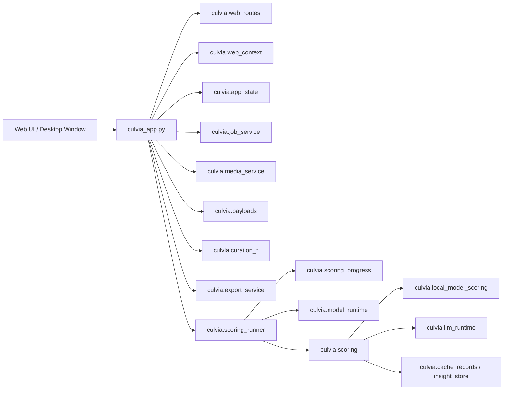

# 架构说明

英文版：[../../en/developer/architecture.md](../../en/developer/architecture.md)

Culvia 的架构目标是：一个 Python 核心、一个 Web 前端、一层轻薄桌面壳，同时支持 pip、本地 Web 和桌面 App 分发。

## 原则

- 本地优先：照片、缩略图、SQLite、模型缓存、人工标记和导出默认都在本机。
- Web/App 同源：桌面壳复用 Starlette API、静态前端、评分编排和数据层。
- 桌面壳边界：当前桌面壳实现使用 Tauri，负责窗口、backend 生命周期和原生能力；pywebview 只作为轻量备选，Electron 暂不作为默认路线。
- 业务下沉：`culvia_app.py` 保持为 app factory 和路由 handler，新业务优先进入 `culvia/`。
- 可测试：核心服务使用纯函数或可注入依赖，测试覆盖行为、数据契约和发布包边界，避免依赖脆弱的页面静态字符串检查。

## 运行入口

```text
culvia-supervisor    -> culvia.supervisor:main
culvia-web       -> culvia.server:main
culvia           -> culvia.cli:main
python -m uvicorn     -> culvia_app:app
```

- `culvia-supervisor` 是本地 Web 和桌面 backend 的主入口，提供端口选择、`/health`、ready event 和浏览器打开。
- `culvia-web` 是开发/部署入口。
- `culvia` 是批量评分 CLI。

## 分层



## 核心模块边界

- `culvia_app.py`：创建 Starlette app、挂载静态资源和处理 HTTP 请求。不要继续承载新评分算法、模型下载、导出细节或推荐公式。
- `culvia.web_routes`：声明 API 路由和静态资源挂载，不读取业务状态。
- `culvia.web_context`：把 Starlette request 适配成 runtime config、state store、job service 和授权媒体路径。
- `culvia.app_state`：保存当前结果、来源、筛选、网络、模型和任务状态。
- `culvia.job_service`：管理评分任务、暂停/继续和并发保护。
- `culvia.scoring_runner`：编排来源解析、模型准备、评分进度和结果刷新。
- `culvia.scoring`：本地模型、大模型评分、SQLite 读写和批处理评分统一入口。
- `culvia.recommendation`：推荐分数、筛选判断和权重预设。
- `culvia.gallery_display` / `culvia.payloads`：把 DataFrame、人工标记、LLM insight 和文件信息转换为 UI payload。
- `culvia.curation_*`：人工入选/待复核/淘汰、星级、颜色标签、历史和撤销。
- `culvia.export_service`：导出 CSV、入选照片复制和导出预检。
- `culvia.media_service` / `culvia.media_responses`：媒体路径授权、缩略图、预览图和上传缓存。
- `culvia.llm_config*` / `culvia.secret_store`：OpenAI-compatible 配置、提示词预设、SQLite 非密钥配置和系统 keychain。
- `culvia.desktop_files` / `culvia.capabilities`：桌面原生文件能力和能力降级。

## 前端

`web/index.html` 负责页面结构和静态资源顺序，`web/*.js` 按功能拆分，`web/styles/` 管理 CSS 切片，`web/locales/` 管理翻译文案。`web/app_config.js` 管理前端共享字段列表和静态标签映射，`web/distribution_model.js` 管理分布图数据转换，`web/distribution_view.js` 管理分布图 markup，`web/viewer_inspector.js` 管理选片台评分、信号和洞察 markup，`web/gallery_view.js` 管理照片墙卡片和 tooltip markup，`web/icons.js` 管理 SVG path 数据，`web/ui_helpers.js` 管理无状态渲染 helper。新增 UI 文案必须进入 locale 文件；`web/i18n_messages.js` 只作为聚合入口。不要在模块里嵌入中英文 fallback。图标按钮应提供 `data-ui-tooltip` 或等价可访问说明；被省略文本必须可复制或有完整 title/tooltip。

前端测试优先覆盖：

- i18n key 和 HTML 支持属性。
- 筛选、导出、快捷键、人工判断和 LLM 配置的纯 JS 行为。
- `pyproject.toml` package data 与 HTML 静态引用一致。

不再维护只检查页面静态版本号、CSS 选择器存在性或截图工具包装层的测试。

## 桌面与发布边界

桌面壳 contract 位于 `desktop/tauri/desktop-shell.contract.json`。桌面壳必须保持 local-http 模式、same-origin `/api` 和 `/static`，生产 backend 通过 `culvia-supervisor --port auto --no-open --print-json` 暴露 ready event。

桌面 runtime 模式：

- `full`：默认发布模式。桌面壳启动内置 backend runtime，不要求用户安装 Python。
- `lite`：桌面壳查找 Python 3.11+，创建应用自己管理的 virtualenv，在依赖缺失时安装 `culvia[desktop-runtime]`，然后启动 `python -m culvia.server`。
- `auto`：优先使用内置 backend；找不到内置 backend 时回落到 `lite`。
- `dev`：使用开发服务 `http://127.0.0.1:8501`。

`culvia.runtime_manager` 管理 Python 侧可复用 runtime 命令：`culvia runtime config`、`configure`、`reset-config`、`doctor`、`create`、`install` 和 `ensure`。Desktop Lite 模式先读取 runtime 目录下的 `runtime.json`，再用环境变量作为开发 override。它必须使用用户数据目录下的 virtualenv 或显式配置的 venv，不能把依赖安装到全局 Python。

关键工具：

- `tools/check_desktop_readiness.py`
- `tools/check_desktop_release_preflight.py`
- `tools/check_backend_smoke.py`
- `tools/check_backend_workflow_smoke.py`
- `tools/check_secret_store_keychain_smoke.py`
- `tools/check_macos_app_preflight.py`
- `tools/clean_macos_app_artifacts.py`
- `tools/build_macos_app.py`
- `tools/check_macos_artifact_preflight.py`
- `tools/check_macos_app_launch_smoke.py`
- `tools/build_windows_zip.py`
- `tools/build_linux_tgz.py`
- `tools/check_portable_package_preflight.py`
- `tools/check_portable_package_runtime.py`
- `tools/desktop_release_contract.py`
- `.github/workflows/desktop-release.yml`
- `tools/check_desktop_release_workflow.py`
- `tools/write_release_checksum.py`
- `tools/write_release_evidence_manifest.py`
- `tools/release_status_report.py`

这些工具的职责是发布包和运行时证据，不是替代人工设计 QA。UI 视觉问题应通过实际浏览器预览、针对性前端行为测试和代码审查解决。

## 数据与隐私

- SQLite 存储评分结果、人工判断、LLM insight 和非密钥配置。
- API key 只允许来自环境变量、当前会话或系统 keychain；不要写入 SQLite 明文字段、README、测试 fixture、日志或 Git。
- 缩略图和上传缓存是运行时数据，不能提交。
- 大模型图片评审是显式启用功能；本地模型路径默认不上传图片。
- `tools/clean_runtime_artifacts.py` 用于清理本地运行时产物；它不替代人工检查。
- `bin/culvia-web` 是受版本管理的源码 Web 启动入口。桌面 App 启动属于桌面应用可执行文件和内置 backend，不属于仓库 `bin/` 脚本。
- 运行时数据边界包括：`model_cache/`、`analysis_cache/`、`thumbnail_cache/`、`upload_cache/`、`*.sqlite`、`*.sqlite-*`、`*.db`。

## 测试策略

- 行为单测：`python -m unittest discover -s tests`
- Python 语法：`python -m compileall -q culvia_app.py culvia tests tools`
- 前端语法：`find web -name '*.js' -print0 | xargs -0 -n1 node --check`
- 发布 gate：`python tools/formal_gate.py`
- 桌面 readiness：`python tools/check_desktop_readiness.py --json`

新增测试应证明真实行为或发布风险，不应只锁定实现痕迹。
